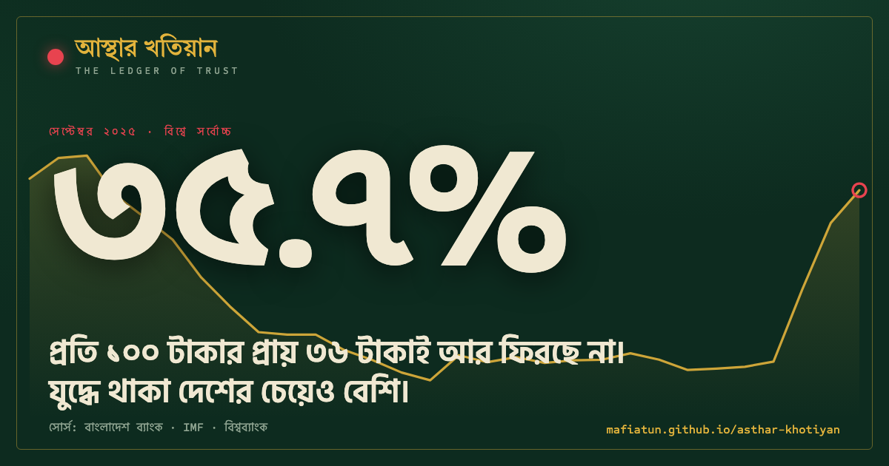

# আস্থার খতিয়ান · The Ledger of Trust

**The Ledger of Trust**, a thirty-year annotated data essay on Bangladesh's
banking-sector non-performing loan (NPL) ratio.

A single, scroll-driven page that follows one number, the share of bank loans
that is not being repaid, across three decades of Bangladesh's history: from the
41.1% peak of 1999, down through the reform decade to 6.1% in 2011, across a
decade of flattered numbers, and up to the highest reported ratio in the world in
2025. It layers in capital adequacy (CRAR) and the IMF's broader distressed-asset
estimates, sets Bangladesh against comparator economies that climbed down their
own bad-loan mountains, and closes with an event ledger of twenty-one exhibits.

**The people’s edition** adds reader-facing tools: a danger-map scatter (NPL vs
CRAR) where Bangladesh sits alone in the negative-capital corner, the White Paper
receipts (every figure attributed to the Dec 2024 committee), a family-share
calculator, a "what could this money have built" converter (Padma Bridges, Dhaka
Metro, remittance-years), and one-tap downloadable stat cards with a share bar.

**Bangla-first, fully bilingual (বাংলা ⇄ English).** The page loads in Bangla by
default; a one-click toggle re-renders the entire essay into English, prose, chart
labels, tooltips, and Bangla numerals, with no page reload. A plain-language primer, a glossary, per-section "story boxes" with worked
examples, per-card source links, and a *Sources & further reading* section make it
approachable for readers new to banking data. Every external link opens in a new tab.

## Screenshot



> _`assets/og-cover.png` is the Bangla-first Open Graph / social-share image
> (1200×630, night-ledger green, gold NPL silhouette, giant ৩৫.৭%). The
> [`social/`](social/) folder also holds a seven-card Instagram/LinkedIn carousel;
> see [`social/README.md`](social/README.md) for the images and captions._

## Live site

**https://mafiatun.github.io/asthar-khotiyan/**

## Data and methodology

The essay tracks one indicator over time and reads it honestly, the definition
of a non-performing loan in Bangladesh changed more than once across these
decades, and each change moves the line for reasons unrelated to borrower
behaviour in that year.

### Indicators

- **NPL ratio**, gross classified loans as a share of total outstanding loans,
  all scheduled banks, year-end. The primary series.
- **CRAR**, sector Capital to Risk-Weighted Assets Ratio (percent). The capital
  cushion; plotted quarterly through the 2024–25 decline, with a Basel III
  reference at the 10% regulatory minimum.
- **Distressed estimates**, the IMF's and Bangladesh Bank's broader measures of
  actual distressed assets (defaulted + rescheduled + written-off), shown against
  the narrower reported classified stock.

### The two classification-rule breaks

- **2012**, Bangladesh Bank adopted stricter, internationally aligned
  classification rules; the reported ratio jumped as previously hidden distress
  was recognised.
- **2025**, loans overdue beyond 90 days were again classified as
  non-performing (replacing the interim 180-day practice), and long-deferred
  distress was booked at once. Both breaks affect comparability across periods.

### Sources

Compiled from public statistics and reporting:

- **Bangladesh Bank**, annual reports, quarterly banking statistics, Financial
  Stability Reports (NPL, CRAR, distressed-asset measures).
- **IMF**, staff assessments and the distressed-asset estimate.
- **World Bank**, bank NPL-to-total-loans indicator (cross-check).
- **ADB**, Asian NPL Watch and the Asian bank average.
- **RBI** (India), **SBP** (Pakistan), **CBSL** (Sri Lanka), **Bank Indonesia /
  OJK** (Indonesia), **NRB** (Nepal), comparator-country trajectories.

Danger-map (cross-country CRAR/NPL) and White Paper receipts:

- **SBP** H1CY25 Mid-Year Performance Review (Pakistan CAR).
- **CBSL** Financial Stability Review 2025 (Sri Lanka).
- **OJK** Board of Commissioners press release, Sep 2025 (Indonesia).
- **IMF** Article IV 2025 (Vietnam) and **IMF** ECF 6th Review, Apr 2025 (Nepal).
- **NRB** provisional financial indicators, mid-Aug 2025 (Nepal CAR).
- **BSP** banking indicators via the Philippine News Agency (Philippines).
- **White Paper on the Bangladesh economy** (committee chaired by Dr. Debapriya
  Bhattacharya, submitted 1 Dec 2024), coverage: The Daily Star, The Business
  Standard, bdnews24, Prothom Alo, Dhaka Tribune.

Cross-country values between anchor years are linearly connected and definitions
vary across regimes, so the comparison panels are best read for shape rather than
decimal precision. Era shading marks who held office; it implies no causal claim.

## Repository structure

```
asthar-khotiyan/
├── index.html          # Markup only
├── css/
│   └── styles.css      # All styles
├── js/
│   ├── data.js         # Every data array (SERIES, QPEAK, CRAR, DIST, ERAS,
│   │                   #   EVENTS, DISC_POS, SNAP, ASIA_AVG, COMP) + EVENT_SOURCES
│   │                   #   and REFERENCES, loaded first
│   ├── data-peoples.js # Peoples-edition data (Q2026, DANGER_MAP, RECEIPT,
│   │                   #   CONVERTER_UNITS), loaded after data.js
│   ├── i18n.js         # বাংলা⇄English engine + full translation tables + toggle
│   ├── story.js        # Shared helpers, reading-progress bar, scrollytelling
│   ├── chart.js        # Explore chart + overlay layers + figures counters
│   ├── compare.js      # Snapshot bars + comparator small multiples
│   ├── ledger.js       # Event ledger cards + click-to-chart + Sources list
│   ├── danger-map.js   # NPL vs CRAR scatter (reads data-peoples.js)
│   └── widgets.js      # Receipt, family share, converter, share bar, stat cards
├── assets/
│   ├── favicon.svg     # A red disc on bottle green
│   └── og-cover.png    # 1200×630 Bangla-first social-share image (night-ledger)
├── README.md
├── LICENSE
├── CITATION.cff
└── .gitignore
```

Scripts are vanilla JavaScript with no framework and no build step. Load order
matters, `data.js` defines the globals the other scripts read, so it must load
first.

## Local development

No build step. Either:

- Open `index.html` directly in a browser, or
- Serve the folder (recommended, so relative paths behave exactly as on Pages):

  ```bash
  python -m http.server 8000
  # then visit http://localhost:8000
  ```

## Roadmap

- **World Bank Z-score layer**, a bank-stability (distance-to-default) overlay.
- **Exact annual comparator series**, replace the anchor-year interpolation in
  the small multiples with full annual data where regulators publish it.
- **PNG export for social**, one-click export of the chart for sharing.

## Data disclaimer

This is an independent data essay. Figures are compiled from public sources
(Bangladesh Bank, IMF, World Bank, ADB, and national regulators) and cited public
reporting. Classification-rule changes in 2012 and 2025 affect comparability
across periods, as noted above. This work is not affiliated with, or endorsed by,
any of the institutions named. Corrections and source suggestions are welcome.

## Credit

Compiled and written by **Mafizul Islam**, [linkedin.com/in/mafizul](https://www.linkedin.com/in/mafizul)

Code is released under the MIT License; the data compilation is released under
CC BY 4.0. See [`LICENSE`](LICENSE) and [`CITATION.cff`](CITATION.cff).
